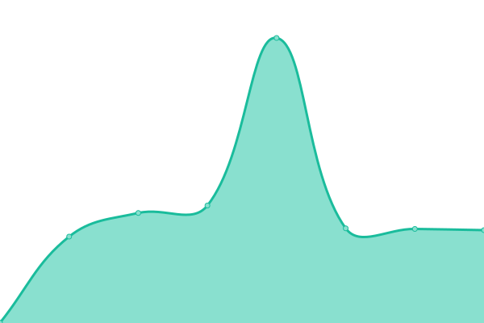

# [📈 Live Status](https://ThitsaX.github.io/uptime/): <!--live status--> **🟥 Complete outage**

This repository contains the open-source uptime monitor and status page for [ThitsaX](https://ThitsaX.github.io/uptime/), powered by [Upptime](https://github.com/upptime/upptime).

With [Upptime](https://upptime.js.org), you can get your own unlimited and free uptime monitor and status page, powered entirely by a GitHub repository. We use [Issues](https://github.com/ThitsaX/uptime/issues) as incident reports, [Actions](https://github.com/ThitsaX/uptime/actions) as uptime monitors, and [Pages](https://status.thitsax-pre.com) for the status page.

<!--start: status pages-->
<!-- This summary is generated by Upptime (https://github.com/upptime/upptime) -->
<!-- Do not edit this manually, your changes will be overwritten -->
<!-- prettier-ignore -->
| URL | Status | History | Response Time | Uptime |
| --- | ------ | ------- | ------------- | ------ |
|  demowallet | 🟥 Down | [demowallet.yml](https://github.com/ThitsaX/uptime/commits/HEAD/history/demowallet.yml) | 

 866ms
     
 | 

<a href="https://status.thitsax-pre.com/history/demowallet">36.95%</a>
    

|  demomfi | 🟥 Down | [demomfi.yml](https://github.com/ThitsaX/uptime/commits/HEAD/history/demomfi.yml) | 

 638ms
     
 | 

<a href="https://status.thitsax-pre.com/history/demomfi">1.74%</a>
    

|  tpp | 🟥 Down | [tpp.yml](https://github.com/ThitsaX/uptime/commits/HEAD/history/tpp.yml) | 

 627ms
     
 | 

<a href="https://status.thitsax-pre.com/history/tpp">11.99%</a>
    

|  musoni | 🟥 Down | [musoni.yml](https://github.com/ThitsaX/uptime/commits/HEAD/history/musoni.yml) | 

 614ms
     
 | 

<a href="https://status.thitsax-pre.com/history/musoni">17.83%</a>
    

<!--end: status pages-->

[**Visit our status website →**](https://status.thitsax-pre.com)

## 📄 License

- Powered by: [Upptime](https://github.com/upptime/upptime)
- Code: [MIT](./LICENSE) © [Anand Chowdhary](https://anandchowdhary.com), supported by [Pabio](https://pabio.com)
- Data in the `./history` directory: [Open Database License](https://opendatacommons.org/licenses/odbl/1-0/)
